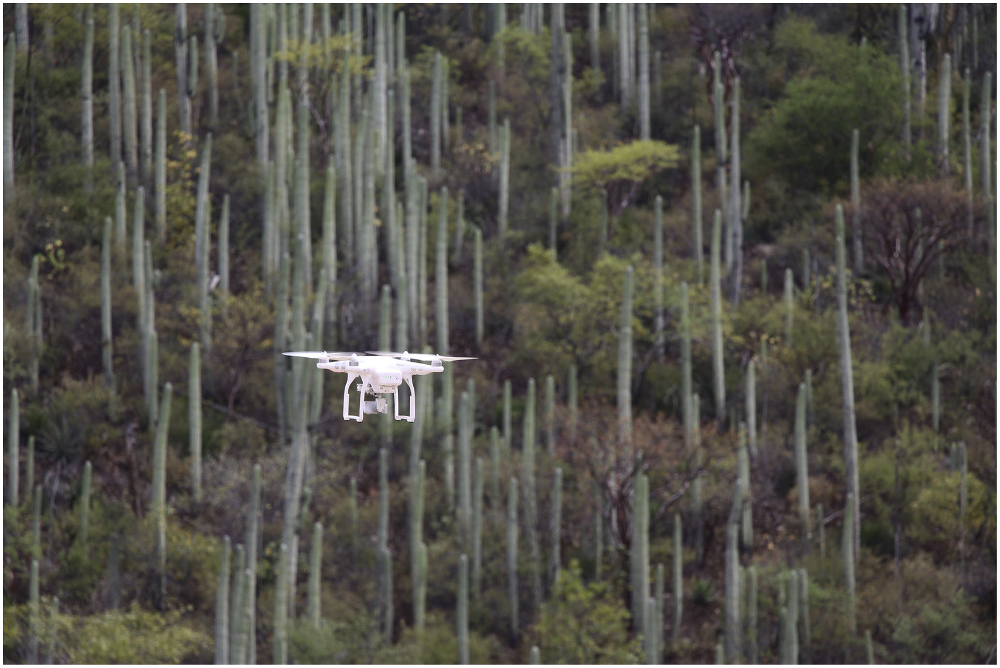
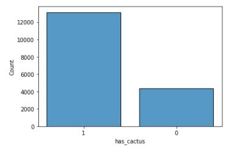

# Aerial Cactus Identification Using Deep Learning

## Overview

With the effects of climate change impacting the globe now more than ever, it is critical to maintain healthy natural areas as much as possible. Human activity has a large impact on environmental health, and tracking that impact is critical. Activities like logging, mining, and agriculture can destroy the functioning of natural areas. In each ecosystem, there are plants and animals that have an outsized impact on the healthy balance found in the region. These keystone species are critical to the survival of many other species in the region. Performing an accurate account of the species present can give insight into the health of a given area, and can help pinpoint areas that are in special need of immediate restoration efforts.

## Business and Data Understanding

The Mexican Government has partnered with the VIGIA project, which aims to create an autonomous surveillance system for monitoring the ecological health of protected natural areas. The first step in this project is to use drone footage to identify critical, or keystone species in the images. The initial images are from the Tehuacán-Cuicatlán Valley, a semi-arid zone in southern Mexico. This area was chosen because of its wide biodiversity and the importance that the ecology plays in the health of the region. It became a UNESCO World Heritage Site in 2018 in an effort to protect the area. Despite this protection, human activity is still impacting the health of the region.

Our work focuses on columnar cactus recognition as they are a keystone species in the region. Our dataset includes over 16,000 RGB images representing an area of over 10,000 km^2. The images were taken by a DJI Phantom 3 Advanced drone flying at 100m. The images were manually identified and marked.

Care must be taken to ensure that images labeled as having cactus present are accurate. While it would cause a waste of labor to move to intervene in an area that was incorrectly marked as not having cacti, it would be more problematic to miss impacted areas all together. This would mean areas that are in need of restoration would go unnoticed.

Our images have been previously resized from the original images so no resizing was necessary. There is a large imbalance between the two classes. There are 3 times as many cacti images as no cacti images.

## Modeling
Before any image augmentation was done, the images were split into a training set and a validation set. Our first step was to pre-process the images in the training and validation sets before putting them through our models. This process involved scaling the images down for ease of processing and implementing data augmentation to help deal with the class imbalance. The images were flipped vertically and horizontally. After preprocessing, our models were put through CNNs and learning rate reduction techniques were implemented to improve the training process. The model's performance was evaluated which informed any changes made. I ran 4 different types of models that were evaluated on the validation set.

- Simple Baseline Model
- Convolutional Neural Network with MaxPooling
- Convolutional Neural Netowrk with Maxpooling, Early Stop, and Learning Rate Reduction
- Convolutional Neural Network with Multiple Maxpooling, Early Stop, and Learning Rate Reduction

## Evaluation

After iternating through numerous models, we found that a CNN with 11 layers that also implemented a learning rate reduction function performed the best across all metrics. We looked to ensure that our critical metric, precision, was performing as high as possible. In this model we acheived a precision score of 99.73% as well as a recall score of 99.70%, with an overall accuracy of 99.57%. 

## Conclusion

Our final model performs very well on unseen data and we are highly confident that our model is generalizable to uneen photos and would be an effect tool for the Mexican Government to begin their environmental site assessments using drones. 

## Next Steps

Species classification expansion - Moving forward, we would like to expand our model to recognize and classify other critical plant and animal species in the region. This would allow the model to give a complete ecological health account of the region.

Specific Human Impact Assessment - Right now, our model is looking for the lack of certain critical plant species to evaluate the consequences of human impact. A better solution would be to train a model to specifically look for the hallmarks of negative human activity in sensitive areas like evidence of logging, mining, or agriculture.

Species Count - To make the model more robust, adding in the capacity to estimate the number of taget species present in an image would help with any enviornmental site assessment. 

## Repository Navigation

Notebooks

- All notebook were run using Kaggle and can be found here
- Final notebook can be found on Kaggle or Github
- Original Data can be found here
- A pdf of the presentation can be found here

